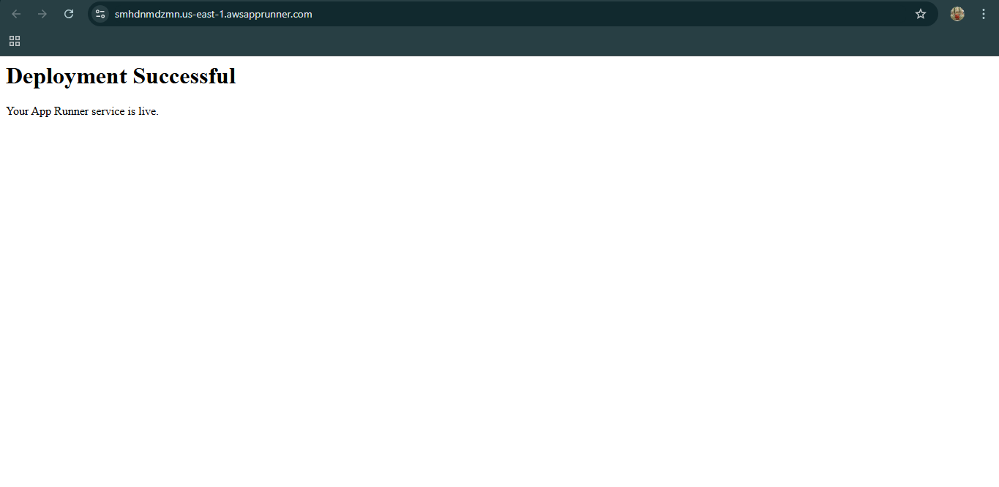

# 🚀 Automated Web Deployment on AWS App Runner

This project demonstrates a production-ready **CI/CD pipeline**. By connecting GitHub to **AWS App Runner**, any code changes pushed locally are automatically built and deployed to a live cloud environment.

## 🌐 Live Application
**Status:** ✅ Running  
**URL:** [https://smhdnmdzmn.us-east-1.awsapprunner.com](https://smhdnmdzmn.us-east-1.awsapprunner.com)

---

## 📸 Proof of Deployment & Automation

### 1. Initial Deployment
The first successful launch of the Node.js server on AWS infrastructure.


### 2. Verified CI/CD Update (The "Pro App" Change)
To test the automation, I updated the `index.js` locally and pushed to GitHub. AWS App Runner detected the change and automatically updated the live site to "Welcome to My Pro App" without any manual intervention.


### 3. AWS Infrastructure Health
The AWS App Runner console confirms the service status is **Running** and healthy, linked directly to the GitHub source.


---

## 🛠️ Technical Stack
* **Runtime:** Node.js 18 (Express.js framework)
* **Cloud Provider:** AWS (App Runner)
* **Automation:** GitHub Source Connection (CI/CD)
* **Tools:** VS Code, Git Bash

## ⚙️ How it Works
1. **Local Development:** Code is written and tested in VS Code.
2. **Version Control:** Changes are committed and pushed via Git Bash:
   ```bash
   git add .
   git commit -m "Updated homepage to Pro App"
   git push origin main
